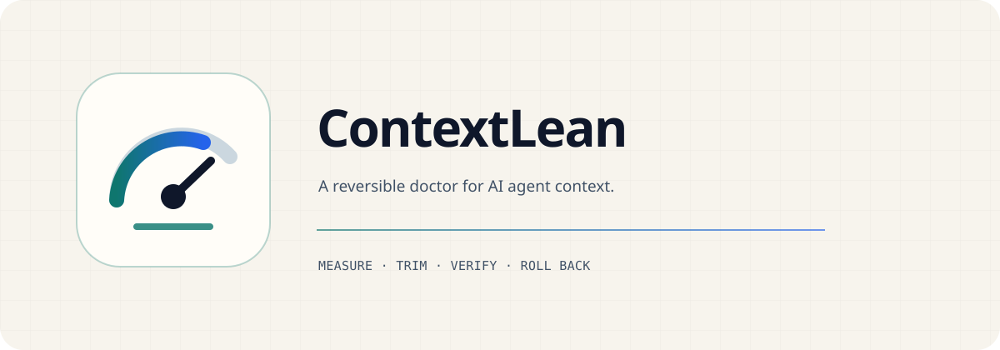

<picture>
  <source media="(prefers-color-scheme: dark)" srcset="assets/contextlean-hero-dark.svg">
  <source media="(prefers-color-scheme: light)" srcset="assets/contextlean-hero-light.svg">
  
</picture>

<div align="center">
  <a href="README.md">English</a> · <a href="README.zh-CN.md">简体中文</a>
</div>

<div align="center">
  <a href="https://github.com/Offwhite-Del/contextlean/actions/workflows/ci.yml"></a>
  <a href="https://github.com/Offwhite-Del/contextlean/releases"></a>
  <a href="LICENSE"></a>
  
</div>

ContextLean 是面向 AI 编程 Agent 的本地、可回滚、证据驱动上下文优化器。它帮助 Codex、ChatGPT 桌面端、Claude Code 和其他兼容 Agent Skills 的客户端改善可控运行框架上下文，但不会假装能够加速模型厂商的服务端推理。

> **当前状态：** `v0.2.0` 工作树在原有哈希保护 apply/rollback 闭环上增加了仅元数据快照、可插拔优化实验、质量优先选优和来源绑定的 Context Pack。所有阈值仍是审查门，不是通用质量标准。

## 为什么需要 ContextLean

Agent 的实际表现由两个不同层面共同决定：

| 层面 | ContextLean 可以改善 | ContextLean 无法改变 |
| --- | --- | --- |
| 本地 Agent 运行框架 | 常驻指令、已发现的 Skills、已启用插件、空转 hooks、跨厂商配置 | — |
| 模型服务商 | — | 推理速度、容量、路由、限流和模型能力 |

ContextLean 把可控层变得可测量、可评测、可回滚。只有冻结任务证明候选带来实质质量或效率收益，才算真正改善。

## 它如何工作

1. **测量**已知表面，生成不含正文的快照和因果哈希。
2. **诊断**过大或冲突规则、Skill 元数据/正文负载、空转 hooks 和跨厂商配置。
3. **生成有界候选**：通过 argv 适配器调用优化器，不内置 provider 凭证。
4. **冻结评测**：用已核验沙箱 runner 执行基线/候选，并匿名盲审。
5. **质量优先选优**：只有一个候选带来实质且非支配收益时才生成 plan。
6. **渲染来源绑定的 Context Pack**：source、parser、schema、prompt、权限、引用和最终渲染预算任一失效即拒绝。
7. **执行、验证或回滚**：使用完整哈希、备份和回执。

ContextLean 编排在本地完成、产品本身零遥测；除 Node.js 18+ 外没有运行时依赖。用户提供的实验 adapter 是独立子进程：Agent adapter 可能连接其已配置的模型服务。运行 `experiment generate/run` 前，必须复核 adapter 及明确选中的非敏感数据。

## 快速开始

直接从 GitHub 运行：

```bash
npx --yes github:Offwhite-Del/contextlean audit --scope repo
npx --yes github:Offwhite-Del/contextlean doctor
```

或者克隆后在本地验证：

```bash
git clone https://github.com/Offwhite-Del/contextlean.git
cd contextlean
npm test
node bin/contextlean.mjs doctor
```

`audit` 默认只审计当前仓库；`doctor` 同时审计仓库和用户级 Agent 配置。两者都不会修改文件。

## 查看实际输出

对 ContextLean 自身运行只读仓库审计会得到：

```text
ContextLean 0.2.0
Scope: repo
Instructions: 1 files, 499 bytes (~125 tokens)
Skills: 0; enabled plugins: 0
Privacy: no auth files, secret values, or session transcripts read
Findings: none at current heuristic thresholds
```

输出展示的是测量结果与启发式发现；“没有发现”不代表任何仓库都已达到最优配置。

## 命令

```text
contextlean audit [--root PATH] [--scope repo|home|all] [--json]
contextlean doctor [--root PATH] [--home PATH] [--json]
contextlean snapshot --root PATH --scope repo|home|all --write FILE
contextlean plan [--root PATH] [--scope repo|home|all] [--write FILE]
contextlean experiment init --snapshot FILE --tasks FILE --profile FILE --model NAME --reasoning LEVEL --write FILE
contextlean experiment generate --experiment FILE --adapter FILE --target PATH --write FILE
contextlean experiment run --experiment FILE --candidate FILE --runner FILE --judge FILE --write FILE
contextlean experiment select --experiment FILE --candidate FILE --result FILE --report FILE [--write-plan FILE]
contextlean pack validate --manifest FILE --source-versions FILE --root PATH --permission-fingerprint VALUE --parser-version VALUE --content-schema-version VALUE --prompt-sha256 SHA
contextlean pack render --manifest FILE --source-versions FILE --root PATH --permission-fingerprint VALUE --parser-version VALUE --content-schema-version VALUE --prompt-sha256 SHA --write FILE [--allow-candidate]
contextlean apply --plan FILE --yes [--root PATH]
contextlean verify --receipt FILE [--json]
contextlean rollback --receipt FILE --yes
```

## 证据驱动实验

可从 [`examples/optimization/`](examples/optimization/) 的公开 6 项烟雾任务、24 项冻结任务、烟雾 profile 和完整 profile 起步。这些 fixture 只验证协议和质量门；fake adapter 通过不代表真实 Agent 的质量或速度有提升。在 POSIX 上，ContextLean 以 `0600` 写实验产物；Windows 上继承所在目录 ACL，因此必须使用用户私有的 `.contextlean/` 目录，并始终排除版本控制。

Adapter 使用 [`contextlean.adapter/v1`](plugins/contextlean/skills/optimize-agent-context/schemas/adapter.schema.json)：绝对 executable、所有文件参数使用绝对路径、stdin 单个 JSON 请求和 stdout 单个 JSON 响应。Runner 必须用 SHA-256 绑定通过的沙箱资格回执，并回报实际观察到的模型、reasoning、会话和工具策略；优化器只收到非 held-out 任务；runner 永远收不到确定性断言答案；持久结果只保存输出与盲审理由的哈希，不保存原文。ContextLean 不向 adapter 继承代理环境变量；任一效率 guardrail 缺失时转人工复核。Adapter 会收到选定目标或任务输出，并可能发送给其已配置 provider；ContextLean 不内置凭证，也不暗中选择 provider。完整协议见[按需 reference](plugins/contextlean/skills/optimize-agent-context/references/protocols-and-evaluation.md)。

## 作为 Agent Skill 安装

### ChatGPT 桌面端和 Codex

```bash
codex plugin marketplace add Offwhite-Del/contextlean \
  --sparse .agents/plugins \
  --sparse plugins
codex plugin add contextlean@contextlean
```

重启 ChatGPT 桌面端或新建 Codex CLI 会话，然后调用 `$optimize-agent-context`，也可以直接要求 Codex 审计 Agent 环境。

### Claude Code 和 Claude Code Desktop

```bash
claude plugin marketplace add Offwhite-Del/contextlean \
  --sparse .claude-plugin plugins
claude plugin install contextlean@contextlean
```

重载插件或新建会话，然后调用 `/contextlean:optimize-agent-context`，也可以直接要求 Claude 审计 Agent 环境。

### 其他 Agent Skills 客户端

可移植 Skill 位于 [`plugins/contextlean/skills/optimize-agent-context/`](plugins/contextlean/skills/optimize-agent-context/)。使用目标客户端的 Skill 安装器，或复制到它支持的 Skill 目录即可。Codex 与 Claude 插件共用同一份 Skill、参考说明和 CLI 实现，避免双份规则漂移。

## 安全变更流程

```bash
contextlean audit --root . --json
contextlean plan --root . --write .contextlean/plan.json
# 审阅并补全计划中的 replace 操作。
contextlean apply --plan .contextlean/plan.json --yes
contextlean verify --receipt .contextlean/backups/<id>/receipt.json
contextlean rollback --receipt .contextlean/backups/<id>/receipt.json --yes
```

ContextLean 只接受已知规则文件名和 `SKILL.md` 的完整替换。每个操作必须携带当前 SHA-256；如果源文件在计划生成后发生变化，ContextLean 会拒绝覆盖。配置类发现只提供建议。

## 安全边界

ContextLean **不会**：

- 读取认证文件、钥匙串、`.env`、密钥值或私人 Agent 会话；
- 上传提示词、配置、代码、报告或遥测；
- 删除文件、安装服务、启用 hooks 或添加 MCP 服务器；
- 自动判定“指令越短越好”；
- 把 held-out 任务交给候选生成器，或持久化原始评测输出；
- 自动应用入选候选，或把 Context Pack 当作 canonical 状态；
- 承诺“发挥模型 100% 能力”或消除模型服务商与网络延迟。

上面的“不上传”指 ContextLean 本身。用户选择的 Agent adapter 可能联网，并把明确请求发送给该 Agent 已配置的 provider；未经单独授权，不要选择机密或私人目标。

计划、备份和回执保存在 `.contextlean/`，默认已被 Git 忽略。分享前仍应单独进行脱敏审查。

## 方法与初始实证

CLI 负责确定性工作：测量、产物绑定、adapter 合同、因果失效、质量门、哈希、备份、精确写入、验证和恢复。Skill 负责上下文判断：哪些边界必须保留、哪些细节可以按需加载，以及哪些任务代表真实质量。

首个真实案例把常驻规则从 6,148 字节降到 3,191 字节（减少 48.1%），相同简单 Codex 提示减少 751 个输入 tokens。单次延迟也有下降，但受网络与缓存影响，**不构成**产品基准或性能保证。

## 相关项目

- [PrismoDev](https://github.com/shanirsh/prismodev) 侧重本地会话可观测性、token 浪费、噪声输出和会话后期验证。
- [ECC](https://github.com/affaan-m/ECC) 提供覆盖面较广的跨 Agent Skills、hooks、规则和编排能力集合。
- [OpenSSF Scorecard](https://github.com/ossf/scorecard) 衡量开源项目的安全实践，可以补充 ContextLean，但不负责优化 Agent 上下文。

ContextLean 刻意保持窄范围：诊断本地 Agent 配置，让经过审阅的变更可回滚；不读取私人会话，也不增加新的运行时控制平面。

## 项目结构

```text
bin/contextlean.mjs                         CLI 入口
plugins/contextlean/                       Codex 与 Claude 插件包
  skills/optimize-agent-context/           Skill、schema、reference 与 CLI
examples/optimization/                     公开烟雾/完整任务和质量 profile
test/*.test.mjs                            跨平台安全与实验测试
.agents/plugins/marketplace.json           Codex marketplace
.claude-plugin/marketplace.json            Claude marketplace
```

## 参与贡献

欢迎提交可复现的缺陷和范围明确的改进。提交 Issue 或 Pull Request 前，请阅读 [CONTRIBUTING.md](CONTRIBUTING.md)、[SECURITY.md](SECURITY.md) 和 [CODE_OF_CONDUCT.md](CODE_OF_CONDUCT.md)。版本变化记录在 [CHANGELOG.md](CHANGELOG.md)。

## 许可证

Apache License 2.0，见 [LICENSE](LICENSE)。
